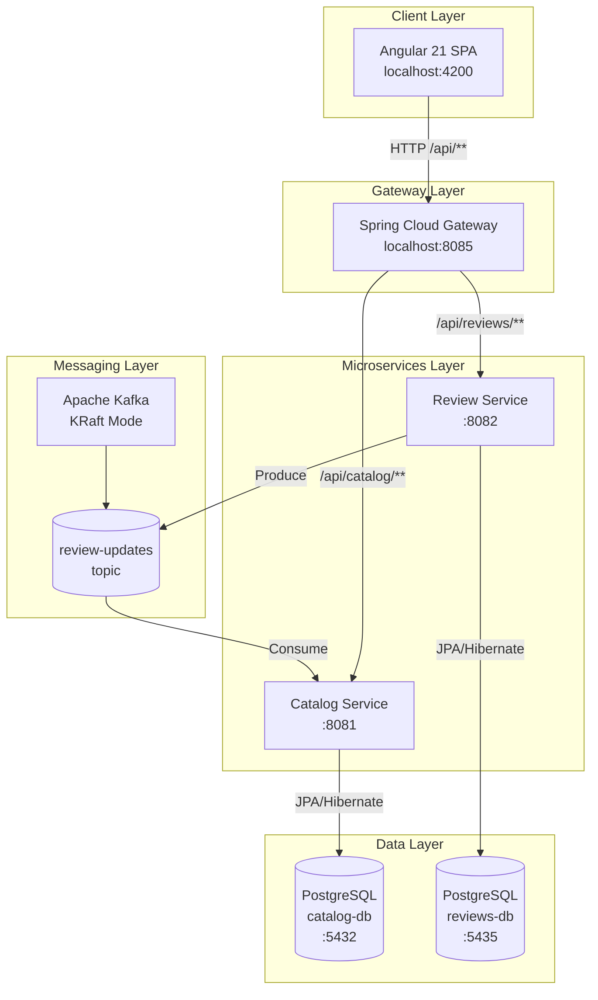
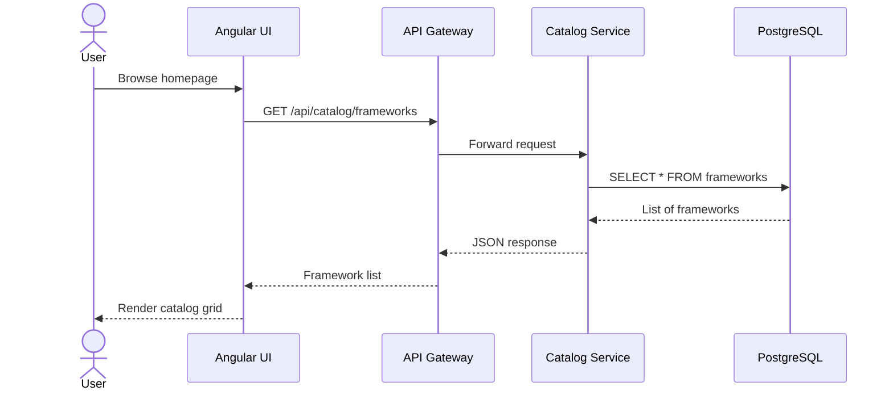
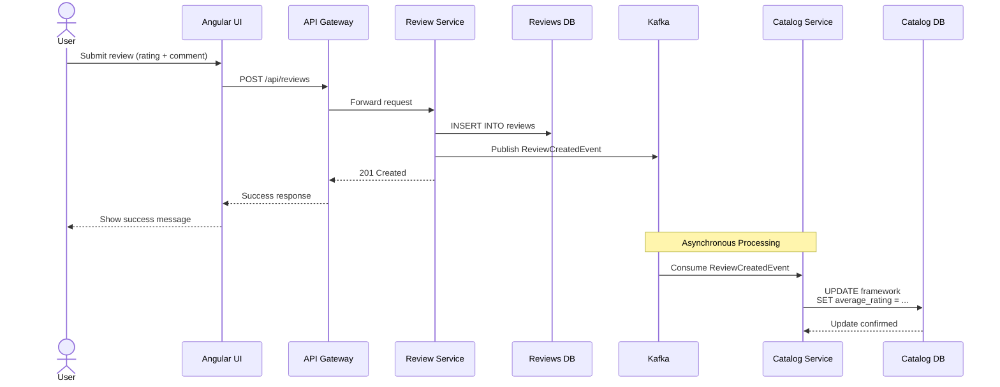
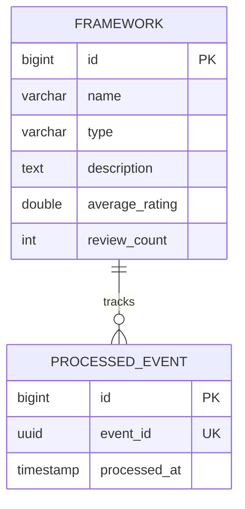
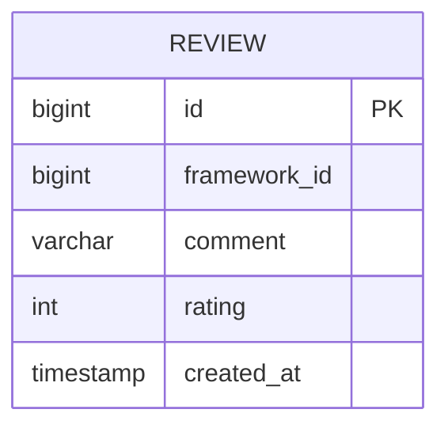

# DevVerdict

> **A portfolio project built to practice and demonstrate modern microservices architecture, event-driven design, and full-stack development.**

DevVerdict is a developer-centric platform where programmers browse programming languages and frameworks, read community reviews, and view aggregated star ratings to help them choose their next tech stack.

This project was built as a **learning exercise and portfolio piece** to explore real-world microservices patterns including service decomposition, API gateways, asynchronous messaging with Kafka, database-per-service, and choreography-based sagas.

---

## Table of Contents

- [Why This Project?](#why-this-project)
- [Architecture Overview](#architecture-overview)
- [System Design](#system-design)
- [Technology Stack](#technology-stack)
- [Getting Started](#getting-started)
- [API Reference](#api-reference)
- [Screenshots](#screenshots)
- [Design Decisions](#design-decisions)
- [Future Roadmap](#future-roadmap)

---

## Why This Project?

Microservices architecture is often discussed in theory but best understood by building. DevVerdict was created to practice:

- **Service Decomposition** — Breaking a monolith into bounded contexts (Catalog vs. Reviews)
- **Inter-Service Communication** — REST for synchronous, Kafka for asynchronous
- **Data Ownership** — Each service owns its database; no shared schemas
- **API Gateway Pattern** — Single entry point with routing, CORS, and load balancing
- **Event-Driven Architecture** — Choreography saga for eventually consistent data
- **Container Orchestration** — Docker Compose for local development
- **Modern Frontend** — Angular with Signals, Material Design, and reactive patterns

---

## Architecture Overview

### High-Level System Diagram



### Request Flow: Browse Catalog



### Request Flow: Submit Review (Choreography Saga)



---

## System Design

### Service Responsibilities

| Service | Responsibility | Database | Events |
|---------|---------------|----------|--------|
| **Catalog Service** | Framework catalog, categories, aggregated ratings | `catalog` PostgreSQL | Consumes `ReviewCreated` |
| **Review Service** | Review CRUD, validation, event publishing | `reviews` PostgreSQL | Produces `ReviewCreated` |
| **API Gateway** | Routing, CORS, load balancing, public entry point | None | None |
| **Angular UI** | User interface, catalog browsing, review submission | None | None |

### Database Schema: Catalog Service



### Database Schema: Review Service



### Event Schema: ReviewCreated

```json
{
  "eventId": "uuid",
  "reviewId": 1,
  "frameworkId": 1,
  "rating": 5,
  "createdAt": "2026-04-30T00:00:00Z"
}
```

### Kafka Topic Design

| Topic | Partitions | Replication | Consumer Group | Purpose |
|-------|-----------|-------------|----------------|---------|
| `review-updates` | 3 | 1 | `catalog-rating-consumer` | Propagate new reviews to update ratings |

---

## Technology Stack

### Frontend

| Technology | Version | Purpose |
|------------|---------|---------|
| Angular | 21.2.x | SPA framework with standalone components |
| Angular Material | 21.2.x | UI component library |
| TypeScript | 5.9.x | Type-safe JavaScript |
| Signals | Built-in | Reactive state management |
| `resource()` | Built-in | Async data fetching |

### Backend Services

| Technology | Version | Purpose |
|------------|---------|---------|
| Spring Boot | 3.5.14 | Microservice framework |
| Spring Cloud Gateway | 4.3.4 | API Gateway |
| Spring Kafka | 3.3.x | Kafka integration |
| Spring Data JPA | 3.5.x | Data access layer |
| PostgreSQL | 17.9 | Relational database |
| Apache Kafka | 3.9.2 | Event streaming (KRaft mode) |

### DevOps & Tooling

| Technology | Purpose |
|------------|---------|
| Docker Compose | Local orchestration |
| Maven | Build automation |
| JUnit 5 + Mockito | Unit testing |
| Testcontainers | Integration testing |
| Vitest | Frontend unit testing |

---

## Getting Started

### Prerequisites

- Docker Desktop 4.x+
- Git

### Quick Start

```bash
# Clone the repository
git clone https://github.com/HomieEddy/DevVerdict.git
cd DevVerdict

# Start the entire stack
docker compose up

# Wait for all services to be healthy (about 90 seconds)
# Then open http://localhost:4200 in your browser
```

### Service Ports

| Service | Host Port | Container Port | Access |
|---------|-----------|----------------|--------|
| Angular UI | 4200 | 4200 | Direct browser |
| API Gateway | 8085 | 8080 | All API requests |
| Catalog Service | — | 8081 | Via Gateway only |
| Review Service | — | 8082 | Via Gateway only |
| Catalog DB | 5432 | 5432 | Direct PostgreSQL |
| Reviews DB | 5435 | 5432 | Direct PostgreSQL |
| Kafka | 9092 | 9092 | Direct Kafka |

### API Endpoints

#### Catalog Service

```
GET  /api/catalog/frameworks          # List all frameworks
GET  /api/catalog/frameworks/{id}     # Get framework details
```

#### Review Service

```
POST /api/reviews                     # Submit a review
GET  /api/reviews/framework/{id}      # Get reviews for framework
```

**Example: Submit a Review**

```bash
curl -X POST http://localhost:8085/api/reviews \
  -H "Content-Type: application/json" \
  -d '{
    "frameworkId": 1,
    "comment": "Great language for enterprise development!",
    "rating": 5
  }'
```

---

## Screenshots

### Catalog Grid

The homepage displays all 126+ frameworks in a responsive Material Design card grid, organized by category chips (Language, Frontend, Backend, Database, etc.).

```
+-------------------------------------------------------------+
|  DevVerdict                        [Search...]              |
+-------------------------------------------------------------+
|                                                             |
|  +----------+  +----------+  +----------+  +----------+     |
|  |  Java    |  | Python   |  | React    |  | Spring   |     |
|  | [Language]|  | [Language]|  | [Frontend]|  | [Backend]|    |
|  |          |  |          |  |          |  |          |     |
|  |  4.5/5   |  |  4.7/5   |  |  4.5/5   |  |  4.5/5   |     |
|  | 12 reviews|  | 8 reviews |  | 24 reviews|  | 15 reviews|    |
|  +----------+  +----------+  +----------+  +----------+     |
|                                                             |
|  +----------+  +----------+  +----------+  +----------+     |
|  | Rust     |  | Docker   |  | Kafka    |  | Vite     |     |
|  | [Language]|  | [DevOps] |  | [Messaging]| | [Build]  |     |
|  |  4.8/5   |  |  4.7/5   |  |  4.5/5   |  |  4.7/5   |     |
|  | 6 reviews |  | 30 reviews|  | 3 reviews |  | 9 reviews |    |
|  +----------+  +----------+  +----------+  +----------+     |
|                                                             |
+-------------------------------------------------------------+
```

### Framework Detail with Reviews

Clicking a framework reveals its detail page with description, rating, an interactive review form, and a list of community reviews.

```
+-------------------------------------------------------------+
|  < Back to Catalog                                          |
|                                                             |
|  +-----------------------------------------------------+    |
|  |  Python                                    [Language]|    |
|  |                                                     |    |
|  |  star star star star star  4.7 / 5 (8 reviews)     |    |
|  |                                                     |    |
|  |  About                                              |    |
|  |  A high-level, general-purpose programming...       |    |
|  +-----------------------------------------------------+    |
|                                                             |
|  +-----------------------------------------------------+    |
|  |  Write a Review                                     |    |
|  |                                                     |    |
|  |  Your Rating:  [star] [star] [star] [star] [star]  |    |
|  |                                                     |    |
|  |  [Your Review                                     ] |    |
|  |  [                                               ]  |    |
|  |  [                                               ]  |    |
|  |  0 / 1000                                         |    |
|  |                                                     |    |
|  |  [Submit Review]                                    |    |
|  +-----------------------------------------------------+    |
|                                                             |
|  +-----------------------------------------------------+    |
|  |  Reviews                                            |    |
|  |                                                     |    |
|  |  star star star star star        Apr 30, 2026      |    |
|  |  Great for data science and ML!                     |    |
|  |  ------------------------------------------------   |    |
|  |  star star star star             Apr 28, 2026      |    |
|  |  Love the readability, but GIL is a pain.          |    |
|  +-----------------------------------------------------+    |
|                                                             |
+-------------------------------------------------------------+
```

---

## Design Decisions

### 1. Choreography-Based Saga (Not Orchestration)

**Decision:** Use choreography where Review Service emits events and Catalog Service reacts.

**Rationale:** For a simple two-service flow, choreography reduces complexity. Adding an orchestrator (like Camunda or Temporal) would be over-engineering for v1.

**Trade-off:** Less visibility into the overall saga state. Mitigated with idempotency and logging.

### 2. Synchronous Kafka Send with Exception

**Decision:** Review Service saves to DB, then synchronously sends to Kafka. If Kafka fails, the transaction rolls back.

**Rationale:** Accepts temporary unavailability over data inconsistency. The user gets an error and can retry.

**Trade-off:** Dual-write risk (DB committed but Kafka fails after commit). For v1, this is acceptable. **v2 will implement the Transactional Outbox pattern.**

### 3. Atomic JPQL Update for Ratings

**Decision:** Use a single `UPDATE` query instead of read-modify-write in Java.

```sql
UPDATE frameworks
SET average_rating = (average_rating * review_count + :newRating) / (review_count + 1),
    review_count = review_count + 1
WHERE id = :frameworkId
```

**Rationale:** Eliminates race conditions when multiple reviews arrive concurrently.

### 4. Idempotent Event Processing

**Decision:** Catalog Service tracks processed `eventId`s in a `processed_events` table.

**Rationale:** Prevents duplicate rating updates if Kafka redelivers messages (at-least-once delivery semantics).

### 5. Database-Per-Service

**Decision:** Catalog and Review services each have dedicated PostgreSQL instances.

**Rationale:** Enforces service boundaries. Services can scale and evolve independently. No shared-schema coupling.

**Trade-off:** Cannot use foreign keys across services. Eventual consistency is required.

### 6. Gateway Handles All CORS

**Decision:** CORS is configured entirely in the Gateway. Downstream services know nothing about cross-origin requests.

**Rationale:** Centralizes cross-cutting concerns. Downstream services remain simpler and more focused.

---

## Project Structure

```
DevVerdict/
├── devverdict-ui/              # Angular 21 frontend
│   ├── src/app/
│   │   ├── components/         # Catalog, FrameworkDetail, FrameworkCard
│   │   ├── models/             # Framework, Review interfaces
│   │   ├── services/           # FrameworkService, ReviewService
│   │   └── ...
│   ├── proxy.conf.json         # Docker proxy config
│   └── proxy.conf.local.json   # Local dev proxy config
│
├── catalog-service/            # Spring Boot — Catalog & Ratings
│   ├── src/main/java/...
│   │   ├── domain/             # Framework, ProcessedEvent entities
│   │   ├── controller/         # FrameworkController
│   │   ├── service/            # RatingUpdateService (Kafka consumer)
│   │   ├── repository/         # JPA repositories
│   │   └── config/             # SeedDataConfig
│   └── Dockerfile
│
├── review-service/             # Spring Boot — Reviews & Kafka Producer
│   ├── src/main/java/...
│   │   ├── domain/             # Review entity
│   │   ├── controller/         # ReviewController
│   │   ├── service/            # ReviewService (Kafka producer)
│   │   ├── dto/                # ReviewRequest, ReviewResponse, ReviewCreatedEvent
│   │   └── config/             # KafkaProducerConfig
│   └── Dockerfile
│
├── gateway/                    # Spring Cloud Gateway
│   ├── src/main/java/...
│   │   ├── config/             # GatewayConfig (routes)
│   │   └── filter/             # LoggingGlobalFilter
│   └── Dockerfile
│
├── docker-compose.yml          # Full stack orchestration
├── pom.xml                     # Parent Maven POM
└── .planning/                  # Project planning artifacts (local-only)
```

---

## Future Roadmap

### v2 — Authentication & Ownership

- [ ] User registration and login (JWT/OAuth2)
- [ ] Reviews tied to authenticated users
- [ ] Users can edit/delete their own reviews
- [ ] Rate limiting and spam protection

### v2 — Admin & Management

- [ ] Admin dashboard for catalog CRUD
- [ ] Review moderation tools
- [ ] Framework category management

### v2 — Enhanced Experience

- [ ] Search and filter catalog by name, category, rating
- [ ] Pagination for catalog and reviews
- [ ] Real-time updates via WebSocket or SSE
- [ ] Structured pros/cons on reviews
- [ ] Review helpfulness voting

### v2 — Infrastructure

- [ ] Transactional Outbox pattern for reliable event publishing
- [ ] Redis for caching and rate limiting
- [ ] Circuit breaker (Resilience4j) in Gateway
- [ ] Production Angular build with nginx
- [ ] Kubernetes deployment manifests

---

## Acknowledgments

This project was built as a hands-on exploration of microservices architecture. It demonstrates patterns commonly used in production systems while remaining simple enough to understand and extend.

**Key learning outcomes:**
- Designing bounded contexts for service decomposition
- Implementing event-driven communication with Kafka
- Handling eventual consistency with idempotency
- Building reactive frontends with Angular Signals
- Containerizing and orchestrating multi-service applications

---

*Built with curiosity, coffee, and a lot of `docker compose logs -f`.*
