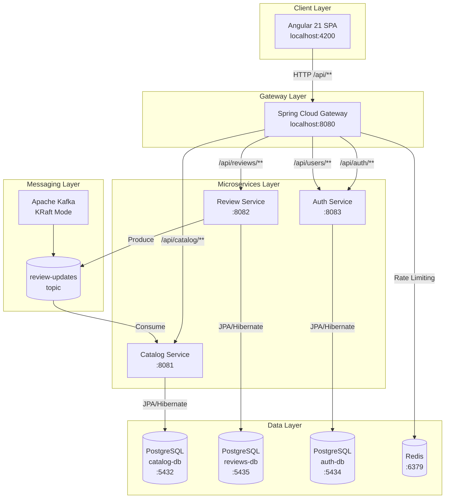

# DevVerdict

> **A portfolio project built to practice and demonstrate modern microservices architecture, event-driven design, and full-stack development.**

DevVerdict is a developer-centric platform where programmers browse programming languages and frameworks, read community reviews, and view aggregated star ratings to help them choose their next tech stack.

This project was built as a **learning exercise and portfolio piece** to explore real-world microservices patterns including service decomposition, API gateways, asynchronous messaging with Kafka, database-per-service, choreography-based sagas, JWT authentication, and real-time updates via Server-Sent Events.

---

## Table of Contents

- [Why This Project?](#why-this-project)
- [Architecture Overview](#architecture-overview)
- [System Design](#system-design)
- [Technology Stack](#technology-stack)
- [Getting Started](#getting-started)
- [API Reference](#api-reference)
- [Design Decisions](#design-decisions)
- [Project Structure](#project-structure)

---

## Why This Project?

Microservices architecture is often discussed in theory but best understood by building. DevVerdict was created to practice:

- **Service Decomposition** — Breaking a monolith into bounded contexts (Catalog, Reviews, Auth)
- **Inter-Service Communication** — REST for synchronous, Kafka for asynchronous
- **Data Ownership** — Each service owns its database; no shared schemas
- **API Gateway Pattern** — Single entry point with routing, CORS, rate limiting, and circuit breakers
- **Event-Driven Architecture** — Choreography saga for eventually consistent data
- **Real-Time Push** — Server-Sent Events for live rating and review updates
- **Container Orchestration** — Docker Compose for local development
- **Modern Frontend** — Angular with Signals, Material Design, and reactive patterns

---

## Architecture Overview

### High-Level System Diagram



---

## System Design

### Service Responsibilities

| Service | Responsibility | Database | Events |
|---------|---------------|----------|--------|
| **Catalog Service** | Framework catalog, search/filter, aggregated ratings, SSE streaming | `catalog` PostgreSQL | Consumes `ReviewCreated` |
| **Review Service** | Review CRUD, pagination, voting, event publishing | `reviews` PostgreSQL | Produces `ReviewCreated` |
| **Auth Service** | User registration, login, JWT issuance, profile management | `auth` PostgreSQL | None |
| **API Gateway** | Routing, CORS, JWT validation, rate limiting, circuit breakers | None | None |
| **Angular UI** | User interface, catalog browsing, review submission, admin dashboard | None | Consumes SSE |

### Event Schema: ReviewCreated

```json
{
  "eventId": "uuid",
  "reviewId": 1,
  "frameworkId": 1,
  "rating": 5,
  "createdAt": "2026-04-30T00:00:00Z"
}
```

### Event Schema: FrameworkRatingEvent (SSE)

```json
{
  "type": "REVIEW_CREATED",
  "frameworkId": 1,
  "newAverage": 4.2,
  "newCount": 15
}
```

### Kafka Topic Design

| Topic | Partitions | Replication | Consumer Group | Purpose |
|-------|-----------|-------------|----------------|---------|
| `review-updates` | 3 | 1 | `catalog-rating-consumer` | Propagate new reviews to update ratings |

---

## Technology Stack

### Frontend

| Technology | Version | Purpose |
|------------|---------|---------|
| Angular | 21.2.x | SPA framework with standalone components |
| Angular Material | 21.2.x | UI component library |
| TypeScript | 5.9.x | Type-safe JavaScript |
| Signals | Built-in | Reactive state management |
| `resource()` | Built-in | Async data fetching |

### Backend Services

| Technology | Version | Purpose |
|------------|---------|---------|
| Spring Boot | 3.5.14 | Microservice framework |
| Spring Cloud Gateway | 4.3.4 | API Gateway |
| Spring Kafka | 3.3.x | Kafka integration |
| Spring Data JPA | 3.5.x | Data access layer |
| Spring Security | 3.5.x | JWT validation |
| PostgreSQL | 17.9 | Relational database |
| Apache Kafka | 3.9.2 | Event streaming (KRaft mode) |
| Redis | 7.x | Rate limiting & session caching |

### DevOps & Tooling

| Technology | Purpose |
|------------|---------|
| Docker Compose | Local orchestration |
| Maven | Build automation |
| JUnit 5 + Mockito | Unit testing |
| Testcontainers | Integration testing |
| Vitest | Frontend unit testing |

---

## Getting Started

### Prerequisites

- Docker Desktop 4.x+
- Git

### Quick Start

```bash
# Clone the repository
git clone https://github.com/HomieEddy/DevVerdict.git
cd DevVerdict

# Start the entire stack
docker compose up

# Wait for all services to be healthy (about 90 seconds)
# Then open http://localhost:4200 in your browser
```

### Service Ports

| Service | Host Port | Container Port | Access |
|---------|-----------|----------------|--------|
| Angular UI (nginx) | 4200 | 4200 | Direct browser |
| API Gateway | 8080 | 8080 | All API requests |
| Catalog Service | — | 8081 | Via Gateway only |
| Review Service | — | 8082 | Via Gateway only |
| Auth Service | — | 8083 | Via Gateway only |
| Catalog DB | 5432 | 5432 | Direct PostgreSQL |
| Reviews DB | 5435 | 5432 | Direct PostgreSQL |
| Auth DB | 5434 | 5432 | Direct PostgreSQL |
| Kafka | 9092 | 9092 | Direct Kafka |
| Redis | 6379 | 6379 | Direct Redis |

---

## API Reference

### Authentication

```
POST /api/auth/register          # Register new account
POST /api/auth/login             # Login, receive JWT
GET  /api/users/me               # Current user profile
GET  /api/users/me/reviews       # Current user's review history
```

### Catalog Service

```
GET  /api/catalog/frameworks                    # List all frameworks
GET  /api/catalog/frameworks/{id}               # Get framework details
GET  /api/catalog/frameworks/{id}/stream        # SSE real-time rating updates
GET  /api/catalog/frameworks/search             # Search & filter frameworks
GET  /api/catalog/frameworks/types              # List distinct framework types
POST /api/catalog/frameworks                    # Create framework (admin)
PUT  /api/catalog/frameworks/{id}               # Update framework (admin)
DELETE /api/catalog/frameworks/{id}             # Delete framework (admin)
```

**Search Parameters:**
- `name` — Filter by name (case-insensitive partial match)
- `type` — Filter by category (e.g., Language, Framework)
- `minRating` — Filter by minimum average rating

### Review Service

```
GET    /api/reviews/framework/{id}              # Get paginated reviews
POST   /api/reviews                             # Submit a review (auth)
DELETE /api/reviews/{id}                        # Delete own review (auth)
POST   /api/reviews/{id}/vote                   # Vote on a review (auth)
```

**Review Pagination:**
- `page` — Page number (0-indexed)
- `size` — Page size (default 10)

**Example: Submit a Review**

```bash
curl -X POST http://localhost:8080/api/reviews \
  -H "Content-Type: application/json" \
  -H "Authorization: Bearer <jwt_token>" \
  -d '{
    "frameworkId": 1,
    "comment": "Great language for enterprise development!",
    "rating": 5,
    "pros": "Ecosystem, performance",
    "cons": "Verbosity"
  }'
```

**Example: Connect to SSE Stream**

```bash
curl -N http://localhost:8080/api/catalog/frameworks/1/stream
```

---

## Design Decisions

### 1. Choreography-Based Saga (Not Orchestration)

**Decision:** Use choreography where Review Service emits events and Catalog Service reacts.

**Rationale:** For a simple two-service flow, choreography reduces complexity. Adding an orchestrator would be over-engineering.

**Trade-off:** Less visibility into the overall saga state. Mitigated with idempotency and logging.

### 2. Transactional Outbox Pattern

**Decision:** Review Service uses the Transactional Outbox pattern for reliable Kafka event publishing.

**Rationale:** Ensures `ReviewCreated` events are published even if Kafka is temporarily unavailable. Events are persisted in an outbox table and published by a background poller.

### 3. Server-Sent Events for Real-Time Updates

**Decision:** Use SSE instead of WebSocket for real-time rating updates.

**Rationale:** Unidirectional push is sufficient for this use case. SSE is simpler, works over HTTP, requires no new dependencies, and is natively supported by Spring WebFlux Gateway.

**Event payload:** Lightweight `{ type: 'REVIEW_CREATED', frameworkId, newAverage, newCount }` — the client decides whether to fetch full data.

### 4. Atomic JPQL Update for Ratings

**Decision:** Use a single `UPDATE` query instead of read-modify-write in Java.

```sql
UPDATE frameworks
SET average_rating = (average_rating * review_count + :newRating) / (review_count + 1),
    review_count = review_count + 1
WHERE id = :frameworkId
```

**Rationale:** Eliminates race conditions when multiple reviews arrive concurrently.

### 5. Idempotent Event Processing

**Decision:** Catalog Service tracks processed `eventId`s in a `processed_events` table.

**Rationale:** Prevents duplicate rating updates if Kafka redelivers messages (at-least-once delivery semantics).

### 6. Database-Per-Service

**Decision:** Catalog, Review, and Auth services each have dedicated PostgreSQL instances.

**Rationale:** Enforces service boundaries. Services can scale and evolve independently. No shared-schema coupling.

**Trade-off:** Cannot use foreign keys across services. Eventual consistency is required.

### 7. Gateway Handles All Cross-Cutting Concerns

**Decision:** CORS, JWT validation, rate limiting, and circuit breakers are configured entirely in the Gateway.

**Rationale:** Centralizes cross-cutting concerns. Downstream services remain simpler and more focused. CORS preflight is never proxied downstream.

### 8. JWT Authentication with Gateway Validation

**Decision:** Auth Service issues JWT tokens. Gateway validates tokens on protected routes.

**Rationale:** Stateless authentication scales horizontally. Services receive user context via headers without managing sessions.

---

## Project Structure

```
DevVerdict/
├── devverdict-ui/              # Angular 21 frontend
│   ├── src/app/
│   │   ├── components/         # Catalog, FrameworkDetail, AdminDashboard, Profile, etc.
│   │   ├── models/             # Framework, Review, User, FrameworkEvent interfaces
│   │   ├── services/           # FrameworkService, ReviewService, AuthService
│   │   └── ...
│   ├── proxy.conf.json         # Docker proxy config
│   └── proxy.conf.local.json   # Local dev proxy config
│
├── catalog-service/            # Spring Boot — Catalog, Ratings & SSE
│   ├── src/main/java/...
│   │   ├── domain/             # Framework, ProcessedEvent entities
│   │   ├── controller/         # FrameworkController (incl. SSE endpoint)
│   │   ├── service/            # RatingUpdateService, SseBroadcastService
│   │   ├── repository/         # JPA repositories
│   │   └── dto/                # FrameworkRatingEvent, FrameworkRequest
│   └── Dockerfile
│
├── review-service/             # Spring Boot — Reviews, Voting & Kafka Producer
│   ├── src/main/java/...
│   │   ├── domain/             # Review, ReviewVote entities
│   │   ├── controller/         # ReviewController
│   │   ├── service/            # ReviewService (Transactional Outbox)
│   │   ├── repository/         # JPA repositories
│   │   └── dto/                # ReviewRequest, ReviewResponse, ReviewCreatedEvent, VoteRequest
│   └── Dockerfile
│
├── auth-service/               # Spring Boot — Authentication & JWT
│   ├── src/main/java/...
│   │   ├── domain/             # User entity
│   │   ├── controller/         # AuthController
│   │   ├── service/            # AuthService, JwtService
│   │   └── dto/                # LoginRequest, RegisterRequest, AuthResponse
│   └── Dockerfile
│
├── gateway/                    # Spring Cloud Gateway
│   ├── src/main/java/...
│   │   ├── config/             # GatewayConfig, SecurityConfig
│   │   └── filter/             # JwtAuthFilter, LoggingGlobalFilter
│   └── Dockerfile
│
├── docker-compose.yml          # Full stack orchestration
├── pom.xml                     # Parent Maven POM
└── .planning/                  # Project planning artifacts (local-only, gitignored)
```

---

## Acknowledgments

This project was built as a hands-on exploration of microservices architecture. It demonstrates patterns commonly used in production systems while remaining simple enough to understand and extend.

**Key learning outcomes:**
- Designing bounded contexts for service decomposition
- Implementing event-driven communication with Kafka
- Handling eventual consistency with idempotency
- Building reactive frontends with Angular Signals
- Implementing real-time updates with Server-Sent Events
- Securing microservices with JWT and gateway-level validation
- Containerizing and orchestrating multi-service applications

---

*Built with curiosity, coffee, and a lot of `docker compose logs -f`.*
